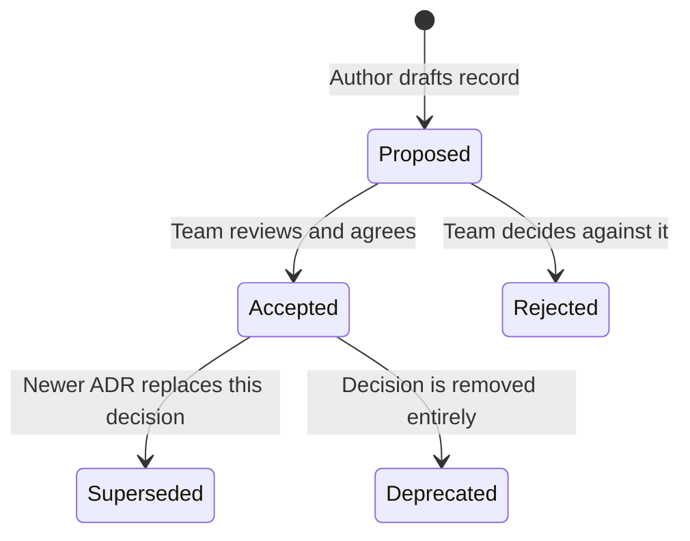

# Architecture Decision Records (ADRs) Guide

This guide establishes the **Architecture Decision Records (ADRs)** framework for the codebase, explaining how to log and track core architectural decisions.

---

## 1. Directory Structure

All ADR resources are located under:
- ADR Directory: [documents/adr/](file:///Users/spakcomm-ajay/Documents/Roadmap/NodejsAppProduction/documents/adr/)
- Standard template: [template.md](file:///Users/spakcomm-ajay/Documents/Roadmap/NodejsAppProduction/documents/adr/template.md)
- ADR-0001 (DI Container): [0001-use-awilix-dependency-injection.md](file:///Users/spakcomm-ajay/Documents/Roadmap/NodejsAppProduction/documents/adr/0001-use-awilix-dependency-injection.md)
- ADR-0002 (Stateless A/B Testing): [0002-stateless-consistent-hashing-ab-testing.md](file:///Users/spakcomm-ajay/Documents/Roadmap/NodejsAppProduction/documents/adr/0002-stateless-consistent-hashing-ab-testing.md)

---

## 2. What is an ADR?

An **Architecture Decision Record (ADR)** is a short document that describes a significant technical decision, the context in which it was made, the options considered, and its downstream consequences (benefits and tradeoffs). 

A collection of ADRs creates an **Architecture Decision Log** that tracks the historical evolution of the codebase structure.

---

## 3. ADR Lifecycle & Statuses

Each ADR transitions through a series of status states:

* **Proposed**: The decision is drafted and currently open for team discussion.
* **Accepted**: The decision has been agreed upon and implemented in code.
* **Superseded**: A newer decision replaces this one. (The original ADR is kept for history but its status is changed to *Superseded by ADR-YYYY*).
* **Rejected**: The proposed decision was rejected after evaluation.

---

## 4. How to Write a New ADR

1. Copy [template.md](file:///Users/spakcomm-ajay/Documents/Roadmap/NodejsAppProduction/documents/adr/template.md) into a new file under `documents/adr/`.
2. Name the file using the format: `NNNN-short-descriptive-title.md` (e.g. `0003-use-loki-for-logging.md`).
3. Fill out the context, drivers, options, and outcomes.
4. Open a Pull Request for review. Once approved and merged, change the status to **Accepted**.
