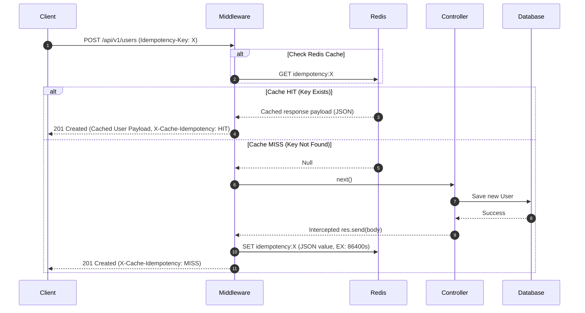

# Idempotency Keys for Safe Retries

This document details the architecture, request lifecycle, Redis caching model, and testing procedures for **Idempotency Keys** in our Node.js production application.

---

## 1. Core Concept & Usecases

In distributed networks, API calls may fail mid-transit or timeouts may occur after processing succeeds but before the client receives the confirmation response. In these scenarios, clients retry the request.

If the request is non-idempotent (e.g. creating a resource like a payment transaction, booking, or user profile), retrying without protection can result in duplicate entities or actions.

An **Idempotency Key** protects against this by ensuring that:
1. The client generates a unique transaction token (usually a UUID) and forwards it in the `Idempotency-Key` header.
2. The server intercepts the request and checks Redis for a completed transaction matching the key.
   * **Cache HIT**: The server returns the cached response immediately, bypassing all database operations, controllers, and background event dispatches.
   * **Cache MISS**: The server executes the request, intercepts the output response payload, caches it in Redis, and returns it to the user.

---

## 2. Request & Interceptor Lifecycle

We implemented the idempotency pattern as an Express middleware in [idempotencyMiddleware.js](file:///Users/spakcomm-ajay/Documents/Roadmap/NodejsAppProduction/src/middlewares/v1/idempotencyMiddleware.js).



---

## 3. Hijacking HTTP Responses in Express

To cache responses transparently without modifying controllers, we intercept `res.send`/`res.json` dynamically inside the middleware:

```javascript
// Intercept response outputs
const originalSend = res.send;

res.send = function (body) {
  res.send = originalSend; // restore method to avoid recursive calls

  // Cache 200-499 ranges (avoid caching server-side 5xx errors to allow true retries on bugs)
  if (res.statusCode >= 200 && res.statusCode < 500) {
    const payloadToCache = JSON.stringify({
      status: res.statusCode,
      headers: res.getHeaders(),
      body: typeof body === 'string' ? body : JSON.stringify(body),
    });

    // Save in Redis with a 24-hour expiration (86400 seconds)
    redisClient.set(`idempotency:${key}`, payloadToCache, 'EX', 86400);
  }

  return res.send(body);
};
```

---

## 4. Test Verification Suite

We developed integration tests in [idempotencyIntegration.test.js](file:///Users/spakcomm-ajay/Documents/Roadmap/NodejsAppProduction/tests/integration/idempotencyIntegration.test.js) asserting three main scenarios:
1. **Pass-through**: GET requests naturally bypass the idempotency filter even if keys are present.
2. **First Call (MISS)**: Mutating requests with keys execute normally, return a `MISS` header, and save response data in Redis.
3. **Repeated Call (HIT)**: Identical requests with same keys return `HIT`, fetch response headers and bodies directly from Redis cache, and bypass database layers completely.
