# Junior Developer Onboarding & Mentoring Playbook

This playbook outlines the structured onboarding phases, pairing workflows, and growth paths designed to set up junior developers for success in this engineering organization.

---

## 1. The 30-60-90 Day Onboarding Roadmap

```mermaid
gantt
    title Junior Onboarding Lifecycle
    dateFormat  X
    axisFormat %d
    section Phase 1 (Day 1-30)
    Local Workspace Setup & Tooling       :active, 0, 10
    Fixing Minor Bugs & ESLint warnings   :10, 20
    First Pull Request & Deploy          :20, 30
    section Phase 2 (Day 31-60)
    Feature Ownership & Unit Testing       :30, 45
    Pair Programming Navigator Role       :45, 60
    section Phase 3 (Day 61-90)
    Independent Task Execution            :60, 75
    ADR Proposal Contributions            :75, 90
```

### Day 1 - 30: Foundation & First Wins
* **Goal**: Understand local workspace mechanics and complete basic tasks.
* **Milestones**:
  * Set up local development environment (Node.js, Docker services, MongoDB/Redis).
  * Run test suite successfully (`npm test`).
  * Fix minor codebase issues (e.g., resolving warnings in [eslint.config.js](file:///Users/spakcomm-ajay/Documents/Roadmap/NodejsAppProduction/eslint.config.js) or resolving items from the [tech_debt_backlog.md](file:///Users/spakcomm-ajay/Documents/Roadmap/NodejsAppProduction/documents/tech_debt_backlog.md)).
  * Open a Pull Request following the PR template and successfully merge code to development.

### Day 31 - 60: Feature Ownership & Collaboration
* **Goal**: Deliver small, end-to-end features and write tests.
* **Milestones**:
  * Take ownership of a ticket (e.g. adding a new validated REST route).
  * Add unit tests with mock dependencies, aiming for high coverage.
  * Actively review peer PRs using the severity prefix tags in [code_review_standards.md](file:///Users/spakcomm-ajay/Documents/Roadmap/NodejsAppProduction/documents/code_review_standards.md).

### Day 61 - 90: Independence & Design Context
* **Goal**: Solve open-ended problems and understand architectural choices.
* **Milestones**:
  * Deliver larger sprint stories independently.
  * Propose minor structural improvements by drafting a new ADR using the template.

---

## 2. Pair Programming Protocols

Pair programming is the fastest way to share context and build confidence. We use two primary configurations:

### A. Driver / Navigator (Standard Setup)
* **Driver (Junior/Senior)**: Focuses on writing code, syntax, and short-term implementation.
* **Navigator (Senior/Junior)**: Focuses on architectural direction, edge cases, review checklists, and test boundary rules.
* *Rule*: Swap roles every **45 minutes** to prevent fatigue and keep both engineers engaged.

### B. Ping-Pong Pairing (Test Driven Development)
* **Engineer A (writes test)**: Creates a failing unit test.
* **Engineer B (writes implementation)**: Writes code to make the test pass, then writes the *next* failing test.
* **Engineer A (writes implementation)**: Writes code to pass that test, and the cycle repeats.
