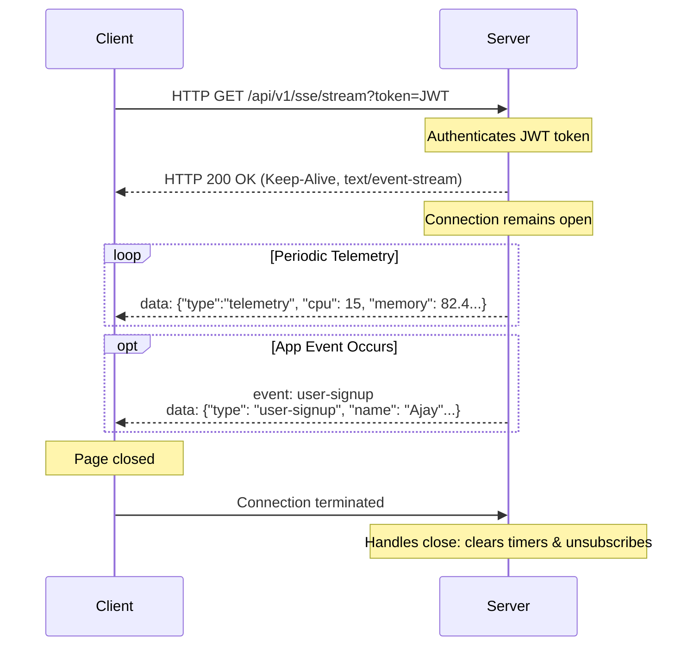

# Server-Sent Events (SSE) for One-Way Streaming

This document details the implementation of Server-Sent Events (SSE) inside our Node.js production application and discusses its architecture, comparison to bidirectional channels (WebSockets), and scaling considerations.

---

## 1. What are Server-Sent Events (SSE)?

Server-Sent Events (SSE) is a web technology that enables a client to receive automatic, real-time updates from a server over a single, long-lived HTTP connection. Unlike WebSockets, SSE is designed specifically for **one-way communication** (server to client).

### Architectural Overview



---

## 2. SSE HTTP Protocol Specifications

To establish an SSE stream, the server responds with a specific set of HTTP headers:

* `Content-Type: text/event-stream` — Directs the browser to process incoming data chunks as events instead of a single page download.
* `Cache-Control: no-cache` — Disables any client or intermediary caching.
* `Connection: keep-alive` — Requests the connection be kept open.

### Event Format

The data sent over the socket follows a simple plain text format separated by double newlines (`\n\n`):

#### Anonymous Event (Default `message` type)
```text
data: {"type":"telemetry","cpu":12.5,"memory":45.3}\n\n
```

#### Custom Named Event
```text
event: user-signup
data: {"type":"user-signup","name":"Ajay","email":"ajay@example.com"}\n\n
```

---

## 3. WebSockets vs. SSE

| Specification | WebSockets | Server-Sent Events (SSE) |
| :--- | :--- | :--- |
| **Direction** | Bidirectional (Duplex) | Uni-directional (Server to Client) |
| **Protocol** | Custom protocol (`ws://` / `wss://`) | Standard HTTP (`http://` / `https://`) |
| **Reconnection** | Must be custom-coded in JavaScript | Automatically handled by the browser |
| **Header Overhead** | Low (after initial upgrade handshake) | Low |
| **Firewall Friendliness**| Requires support for WebSockets upgrades | Works out-of-the-box (uses HTTP/HTTPS ports) |
| **Browser Support** | Universal | Universal (except old IE) |
| **Use Cases** | Multiplayer games, collaborative editing, chat | Stock tickers, news feeds, system monitoring |

---

## 4. Connection Constraints & Scalability

> [!WARNING]
> When using standard HTTP/1.1, browsers impose a maximum limit of **6 open connections per domain name**. If a user opens 6 tabs with active SSE connections, a 7th tab will hang and fail to load any asset from that domain.
> 
> **Solution**: Scale SSE by deploying over **HTTP/2 (H2)** or HTTP/3, which supports multiplexing, lifting the tab limit constraint to hundreds of streams per connection.

---

## 5. Verification

* Dashboard UI: [sse.html](file:///Users/spakcomm-ajay/Documents/Roadmap/NodejsAppProduction/public/sse.html)
* Stream Script: [sse.js](file:///Users/spakcomm-ajay/Documents/Roadmap/NodejsAppProduction/public/sse.js)
