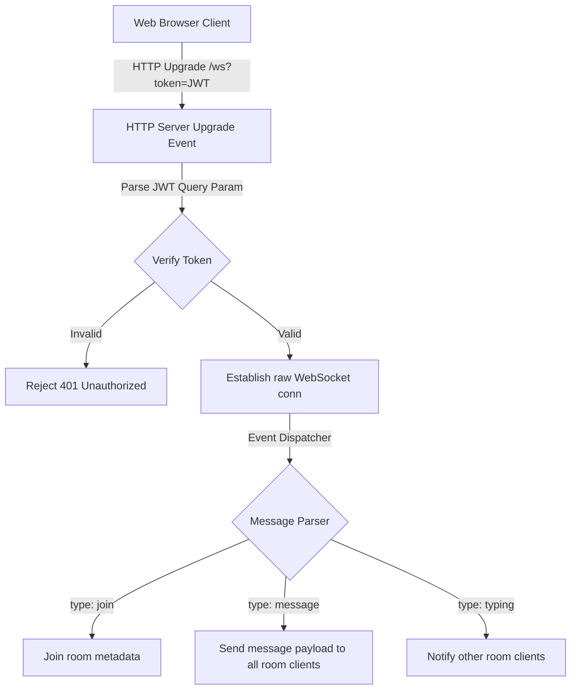

# Lightweight Real-Time Communication with `ws`

This document details the implementation of our lightweight WebSocket solution using the standard Node.js `ws` library. It also highlights differences and considerations when choosing between a low-level library like `ws` and a high-level framework like Socket.io.

---

## 1. Core Architecture

Unlike Socket.io, the `ws` package is a minimal implementation of the WebSocket protocol. It does not provide rooms, custom events, connection heartbeats, or fallback transports. 

We implemented a custom app architecture to achieve high-level features:



### Path-Based Upgrades

To run both `Socket.io` and the raw `ws` server on the same HTTP server port (`5000`), we intercept the HTTP server's `upgrade` event:

```javascript
httpServer.on('upgrade', async (request, socket, head) => {
  const url = new URL(request.url, `http://${request.headers.host}`);
  if (url.pathname === '/ws') {
    // Authenticate and hand over to ws server
    wss.handleUpgrade(request, socket, head, (ws) => {
      wss.emit('connection', ws, request);
    });
  }
  // Allow other upgrade handlers (like Socket.io) to proceed
});
```

---

## 2. Low-Level Protocol Event Payload

Since `ws` only supports raw strings or binary data, we established a JSON protocol for client-server communication.

### Join Room Request (Client → Server)
```json
{
  "type": "join",
  "room": "room:tech"
}
```

### Chat Message Request (Client → Server)
```json
{
  "type": "message",
  "text": "Hello, everyone!"
}
```

### Typing Indicator Request (Client → Server)
```json
{
  "type": "typing",
  "isTyping": true
}
```

### Server Broadcast Message (Server → Room Clients)
```json
{
  "type": "message",
  "userId": "66a1a1f0a123...",
  "user": "Test User",
  "text": "Hello, everyone!",
  "timestamp": "2026-06-05T12:00:00.000Z"
}
```

---

## 3. Comparison: Socket.io vs. `ws`

| Feature | Socket.io | `ws` (Lightweight) |
| :--- | :--- | :--- |
| **Protocol Overhead** | High (wraps frames in Engine.io protocol) | Low (pure RFC 6455 framing) |
| **Namespaces & Rooms**| Out-of-the-box support | Must be implemented manually |
| **Auto-reconnection** | Built-in | Must be coded in client JS |
| **Fallback transport**| Long polling (HTTP) fallback | WebSocket only |
| **Authentication** | Connection middlewares | Manual extraction during HTTP upgrade hook |
| **Ideal for...** | Complex chats, dashboard grids, push notices | High-frequency data feeds, gaming loops |

---

## 4. Verification

* UI Testing Client: [ws-chat.html](file:///Users/spakcomm-ajay/Documents/Roadmap/NodejsAppProduction/public/ws-chat.html)
* Client Logic script: [ws-chat.js](file:///Users/spakcomm-ajay/Documents/Roadmap/NodejsAppProduction/public/ws-chat.js)
