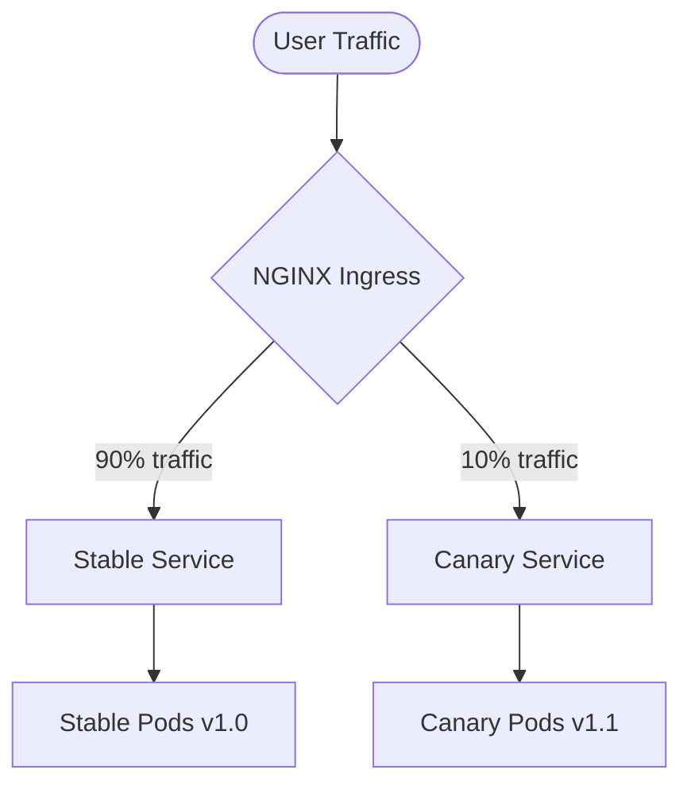

# Zero-Downtime Deployments: Blue-Green & Canary Releases

This document describes how to deploy the Node.js production application with **zero downtime** using Kubernetes-native mechanisms: **Blue-Green deployments** and **Canary releases**.

---

## 1. Blue-Green Deployment Strategy

A Blue-Green deployment keeps two identical physical environments (Deployments) running:
- **Blue**: Currently active production environment.
- **Green**: Idle environment where new code is deployed and verified.

Once the Green environment passes validation, traffic is instantly routed to it by updating the selector on the production Service.


### Manifests Location
- Blue Deployment: [blue-deployment.yaml](file:///Users/spakcomm-ajay/Documents/Roadmap/NodejsAppProduction/kubernetes/strategies/blue-green/blue-deployment.yaml)
- Green Deployment: [green-deployment.yaml](file:///Users/spakcomm-ajay/Documents/Roadmap/NodejsAppProduction/kubernetes/strategies/blue-green/green-deployment.yaml)
- Active Service: [active-service.yaml](file:///Users/spakcomm-ajay/Documents/Roadmap/NodejsAppProduction/kubernetes/strategies/blue-green/active-service.yaml)
- Preview Service: [preview-service.yaml](file:///Users/spakcomm-ajay/Documents/Roadmap/NodejsAppProduction/kubernetes/strategies/blue-green/preview-service.yaml)

### Deployment Steps
1. Deploy the new code version to the **idle** color (e.g., Green):
   ```bash
   kubectl apply -f kubernetes/strategies/blue-green/green-deployment.yaml
   ```
2. Verify the idle version using the **Preview Service**:
   ```bash
   curl http://nodejs-monolith-preview:5000/health
   ```
3. Swap active target using the automated promotion script:
   ```bash
   ./kubernetes/strategies/blue-green/promote.sh
   ```

### Promotion/Rollback Script
The automated promotion script [promote.sh](file:///Users/spakcomm-ajay/Documents/Roadmap/NodejsAppProduction/kubernetes/strategies/blue-green/promote.sh) dynamically switches the active target by patching the selector. If verification fails, it can swap them back immediately.

---

## 2. Canary Releases Strategy

Canary releases introduce a small subset of new-version workloads alongside stable workloads. Only a fraction of production traffic is routed to the new code (the "canary") to limit exposure to potential bugs.



### Manifests Location
- Stable Deployment: [stable-deployment.yaml](file:///Users/spakcomm-ajay/Documents/Roadmap/NodejsAppProduction/kubernetes/strategies/canary/stable-deployment.yaml)
- Canary Deployment: [canary-deployment.yaml](file:///Users/spakcomm-ajay/Documents/Roadmap/NodejsAppProduction/kubernetes/strategies/canary/canary-deployment.yaml)
- Services: [services.yaml](file:///Users/spakcomm-ajay/Documents/Roadmap/NodejsAppProduction/kubernetes/strategies/canary/services.yaml)
- Ingress Config: [ingress-canary.yaml](file:///Users/spakcomm-ajay/Documents/Roadmap/NodejsAppProduction/kubernetes/strategies/canary/ingress-canary.yaml)

### Progressive Traffic Routing Steps
We use NGINX Ingress controller annotations (`nginx.ingress.kubernetes.io/canary`) to split traffic based on weight.

1. Deploy stable and canary environments.
2. Initialize Canary traffic at 10% weight using the Ingress.
3. Automatically adjust weights progressively (e.g., 10% -> 25% -> 50% -> 75% -> 100%) using the rollout script:
   ```bash
   ./kubernetes/strategies/canary/rollout-canary.sh
   ```

### Fallbacks & Rollbacks
If metrics or error-alert logs show anomalies (for example, `/health` reports failures or synthetic metrics drop), the script automatically resets the canary weight annotation to `0` and halts rollout, protecting live production users.
