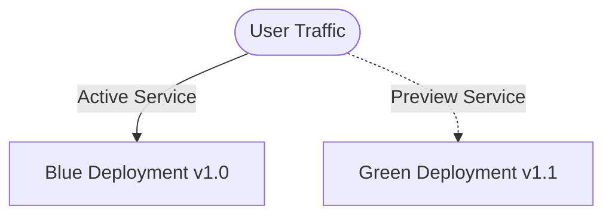
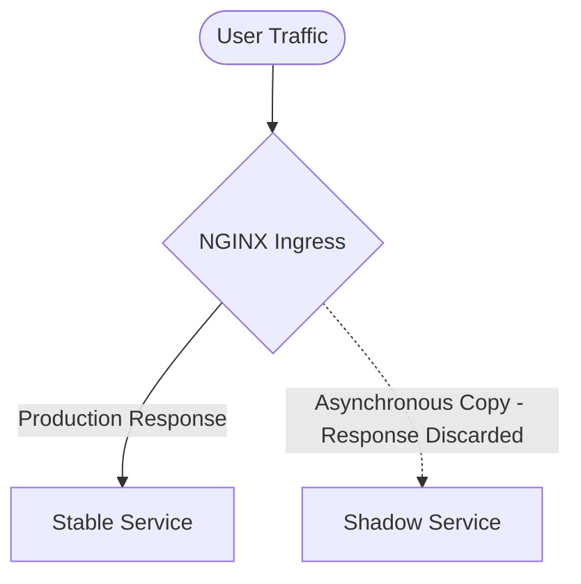

# Zero-Downtime Deployments & Advanced Routing Strategies

This document describes how to deploy the Node.js production application using six distinct release and routing strategies in Kubernetes.

---

## 1. Blue-Green Deployment Strategy

A Blue-Green deployment keeps two identical physical environments (Deployments) running:
- **Blue**: Currently active production environment.
- **Green**: Idle environment where new code is deployed and verified.

Once the Green environment passes validation, traffic is instantly routed to it by updating the selector on the production Service.

### Manifests Location
- Blue Deployment: [blue-deployment.yaml](file:///Users/spakcomm-ajay/Documents/Roadmap/NodejsAppProduction/kubernetes/strategies/blue-green/blue-deployment.yaml)
- Green Deployment: [green-deployment.yaml](file:///Users/spakcomm-ajay/Documents/Roadmap/NodejsAppProduction/kubernetes/strategies/blue-green/green-deployment.yaml)
- Active Service: [active-service.yaml](file:///Users/spakcomm-ajay/Documents/Roadmap/NodejsAppProduction/kubernetes/strategies/blue-green/active-service.yaml)
- Preview Service: [preview-service.yaml](file:///Users/spakcomm-ajay/Documents/Roadmap/NodejsAppProduction/kubernetes/strategies/blue-green/preview-service.yaml)

---

## 2. Canary Releases Strategy

Canary releases introduce a small subset of new-version workloads alongside stable workloads. Only a fraction of production traffic is routed to the new code (the "canary") to limit exposure to potential bugs.

### Manifests Location
- Stable Deployment: [stable-deployment.yaml](file:///Users/spakcomm-ajay/Documents/Roadmap/NodejsAppProduction/kubernetes/strategies/canary/stable-deployment.yaml)
- Canary Deployment: [canary-deployment.yaml](file:///Users/spakcomm-ajay/Documents/Roadmap/NodejsAppProduction/kubernetes/strategies/canary/canary-deployment.yaml)
- Services: [services.yaml](file:///Users/spakcomm-ajay/Documents/Roadmap/NodejsAppProduction/kubernetes/strategies/canary/services.yaml)
- Ingress Config: [ingress-canary.yaml](file:///Users/spakcomm-ajay/Documents/Roadmap/NodejsAppProduction/kubernetes/strategies/canary/ingress-canary.yaml)

---

## 3. Recreate Strategy

The Recreate strategy is a non-rolling update pattern that terminates all existing pods in the Deployment before starting any new ones. While it incurs brief downtime, it guarantees that two versions of the codebase never run concurrently (ideal for breaking database schema migrations).

### Manifests Location
- Recreate Deployment: [recreate-deployment.yaml](file:///Users/spakcomm-ajay/Documents/Roadmap/NodejsAppProduction/kubernetes/strategies/recreate/recreate-deployment.yaml)

---

## 4. Ingress-Based A/B Testing Strategy

This strategy splits traffic based on client attributes (cookies, session parameters) rather than just random percentages, ensuring users get a consistent UX sticky variant.

### Manifests Location
- Ingress Config: [ingress-ab-test.yaml](file:///Users/spakcomm-ajay/Documents/Roadmap/NodejsAppProduction/kubernetes/strategies/ab-testing/ingress-ab-test.yaml)

We use NGINX Ingress annotations like `nginx.ingress.kubernetes.io/canary-by-cookie` targeting cookie names (e.g., `user_tier`). If a client request carries the cookie set to `always`, they are routed to the canary variant B.

---

## 5. Traffic Shadowing (Shadow) Strategy

Shadowing (or mirroring) duplicates production traffic and forwards it to a new release version asynchronously. The responses from the shadowed service are discarded, allowing performance testing under real load without affecting end users.

### Manifests Location
- Shadow Deployment: [shadow-deployment.yaml](file:///Users/spakcomm-ajay/Documents/Roadmap/NodejsAppProduction/kubernetes/strategies/shadow/shadow-deployment.yaml)
- Shadow Service: [shadow-service.yaml](file:///Users/spakcomm-ajay/Documents/Roadmap/NodejsAppProduction/kubernetes/strategies/shadow/shadow-service.yaml)
- Ingress Config: [ingress-mirror.yaml](file:///Users/spakcomm-ajay/Documents/Roadmap/NodejsAppProduction/kubernetes/strategies/shadow/ingress-mirror.yaml)

---

## 6. Quick Pick Strategy (Selective Routing)

Quick Pick (or Dark Launching) routes traffic to the new version selectively based on custom HTTP request headers. This allows internal testers, VIPs, or specific regions to evaluate the release first.

### Manifests Location
- Ingress Config: [ingress-quick-pick.yaml](file:///Users/spakcomm-ajay/Documents/Roadmap/NodejsAppProduction/kubernetes/strategies/quick-pick/ingress-quick-pick.yaml)

Using annotations:
- `nginx.ingress.kubernetes.io/canary-by-header: "X-Beta-Tester"`
- `nginx.ingress.kubernetes.io/canary-by-header-value: "allow"`
